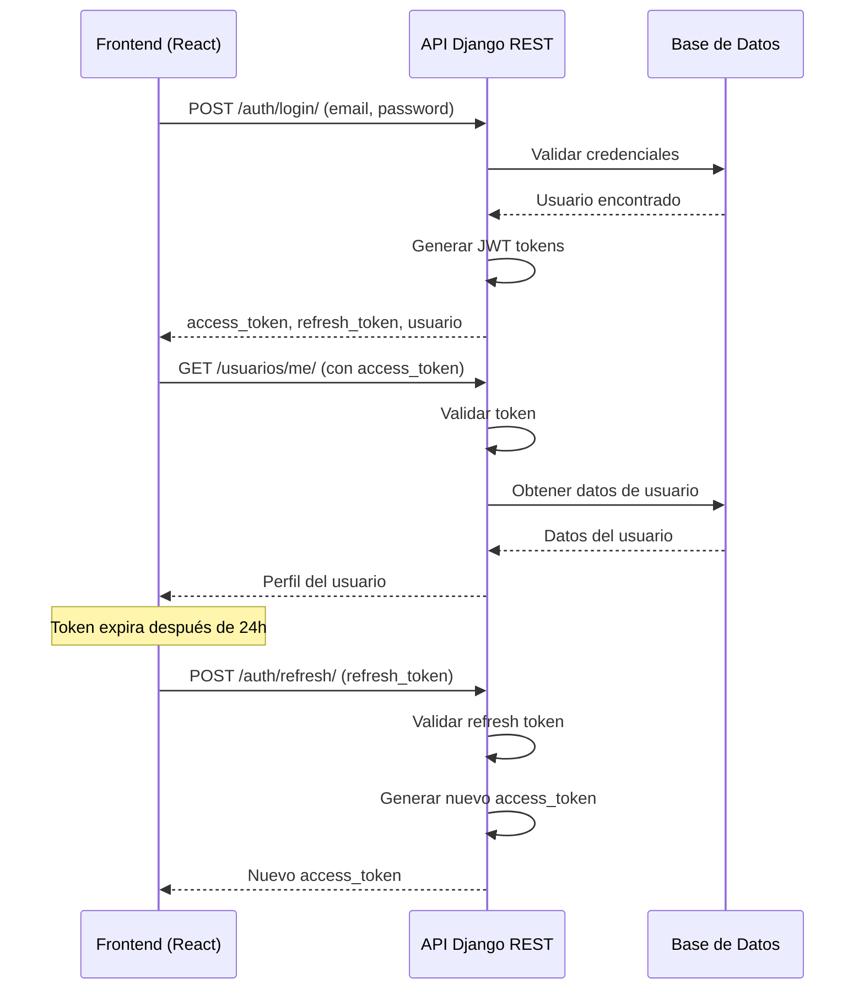

# Autenticación JWT en TiendaUniversitaria

## 1. Descripción General

El sistema de autenticación de TiendaUniversitaria utiliza **JSON Web Tokens (JWT)** con djangorestframework-simplejwt para proporcionar un mecanismo seguro y escalable de autenticación de usuarios.

### Características Clave

- **Tokens de Acceso**: Válidos por 24 horas
- **Tokens de Refresco**: Válidos por 7 días
- **Algoritmo**: HS256 (HMAC SHA-256)
- **CORS Habilitado**: Para React frontend (localhost:3000, localhost:5173)
- **Sin Sesiones**: Completamente stateless

## 2. Flujo de Autenticación



## 3. Endpoints de Autenticación

### 3.1 Login

**POST** `/auth/login/`

Autentica un usuario y retorna tokens JWT.

```json
// Request
{
  "email": "usuario@unl.edu.ec",
  "password": "password123"
}

// Response (200 OK)
{
  "access_token": "eyJ0eXAiOiJKV1QiLCJhbGc...",
  "refresh_token": "eyJ0eXAiOiJKV1QiLCJhbGc...",
  "usuario": {
    "id": 1,
    "email": "usuario@unl.edu.ec",
    "nombre_completo": "Juan Pérez",
    "rol": "estudiante",
    "is_universidad": true
  }
}

// Errores posibles
{
  // 400 - Datos inválidos
  "email": ["Este campo es obligatorio."]
  
  // 401 - Credenciales inválidas
  "non_field_errors": ["Email o contraseña inválidos"]
  
  // 401 - Usuario inactivo
  "non_field_errors": ["Usuario inactivo"]
}
```

### 3.2 Refresh Token

**POST** `/auth/refresh/`

Genera un nuevo token de acceso usando el token de refresco.

```json
// Request
{
  "refresh": "eyJ0eXAiOiJKV1QiLCJhbGc..."
}

// Response (200 OK)
{
  "access": "eyJ0eXAiOiJKV1QiLCJhbGc..."
}

// Error (401)
{
  "detail": "Token is invalid or expired"
}
```

### 3.3 Logout

**POST** `/auth/logout/`

Cierra sesión del usuario (actualmente solo valida la presencia del refresh token).

```json
// Request
{
  "refresh": "eyJ0eXAiOiJKV1QiLCJhbGc..."
}

// Response (200 OK)
{
  "status": "success",
  "message": "Sesión cerrada correctamente"
}

// Error (400)
{
  "status": "error",
  "message": "Refresh token requerido"
}
```

**Nota**: Este endpoint requiere implementar un blacklist de tokens para invalidar tokens de refresco.

### 3.4 Perfil de Usuario

**GET** `/usuarios/me/`

Obtiene el perfil del usuario autenticado.

**Autenticación requerida**: Sí (Bearer token)

```json
// Response (200 OK)
{
  "id": 1,
  "email": "usuario@unl.edu.ec",
  "nombre_completo": "Juan Pérez",
  "identificacion": "1234567890",
  "rol": "estudiante",
  "is_universidad": true,
  "direccion": "Calle Principal 123",
  "telefono": "+593999123456",
  "consentimiento_lopdp": true,
  "fecha_creacion": "2024-01-15T10:30:00Z",
  "ultima_modificacion": "2024-01-15T10:30:00Z"
}

// Error (401)
{
  "detail": "Authentication credentials were not provided."
}
```

**PUT** `/usuarios/me/`

Actualiza el perfil del usuario autenticado.

**Autenticación requerida**: Sí (Bearer token)

```json
// Request (campos actualizables)
{
  "nombre_completo": "Juan Carlos Pérez",
  "identificacion": "1234567890",
  "direccion": "Calle Nueva 456",
  "telefono": "+593999654321"
}

// Response (200 OK)
{
  "id": 1,
  "email": "usuario@unl.edu.ec",
  "nombre_completo": "Juan Carlos Pérez",
  "identificacion": "1234567890",
  "rol": "estudiante",
  "is_universidad": true,
  "direccion": "Calle Nueva 456",
  "telefono": "+593999654321",
  "consentimiento_lopdp": true,
  "fecha_creacion": "2024-01-15T10:30:00Z",
  "ultima_modificacion": "2024-01-15T12:00:00Z"
}

// Error (400) - Email intenta cambiar
{
  "email": ["No puedes cambiar tu email"]
}

// Error (400) - Nombre muy corto
{
  "nombre_completo": ["Asegúrate de que este campo tenga al menos 3 caracteres."]
}
```

## 4. Estructura de JWT

### Access Token

```
Header:
{
  "alg": "HS256",
  "typ": "JWT"
}

Payload:
{
  "token_type": "access",
  "exp": 1705341600,        // Expiration (24 horas)
  "iat": 1705255200,        // Issued at
  "user_id": 1              // Custom claim
}

Signature:
HMACSHA256(base64UrlEncode(header) + "." + base64UrlEncode(payload), SECRET_KEY)
```

### Refresh Token

```
Payload:
{
  "token_type": "refresh",
  "exp": 1705945200,        // Expiration (7 días)
  "iat": 1705255200,        // Issued at
  "user_id": 1              // Custom claim
}
```

## 5. Uso en el Frontend (React)

### 5.1 Configuración Inicial

```javascript
// src/services/api.ts
import axios from 'axios';

const API_URL = 'http://localhost:8000/api/v1';

const apiClient = axios.create({
  baseURL: API_URL,
  headers: {
    'Content-Type': 'application/json'
  }
});

// Interceptor para agregar token a cada request
apiClient.interceptors.request.use((config) => {
  const token = localStorage.getItem('access_token');
  if (token) {
    config.headers.Authorization = `Bearer ${token}`;
  }
  return config;
});

export default apiClient;
```

### 5.2 Login

```javascript
// src/services/auth.ts
import apiClient from './api';

export const loginService = async (email, password) => {
  const response = await apiClient.post('/auth/login/', {
    email,
    password
  });
  
  // Guardar tokens
  localStorage.setItem('access_token', response.data.access_token);
  localStorage.setItem('refresh_token', response.data.refresh_token);
  localStorage.setItem('usuario', JSON.stringify(response.data.usuario));
  
  return response.data;
};
```

### 5.3 Refresh Token Automático

```javascript
// src/services/api.ts - Interceptor de respuesta
apiClient.interceptors.response.use(
  (response) => response,
  async (error) => {
    const originalRequest = error.config;
    
    // Si error 401 y no es refresh request
    if (error.response?.status === 401 && !originalRequest._retry) {
      originalRequest._retry = true;
      
      try {
        const refreshToken = localStorage.getItem('refresh_token');
        const response = await axios.post(`${API_URL}/auth/refresh/`, {
          refresh: refreshToken
        });
        
        // Guardar nuevo token
        localStorage.setItem('access_token', response.data.access);
        
        // Reintentar request original
        originalRequest.headers.Authorization = `Bearer ${response.data.access}`;
        return apiClient(originalRequest);
      } catch (refreshError) {
        // Refresh falló, redirigir a login
        window.location.href = '/login';
        return Promise.reject(refreshError);
      }
    }
    
    return Promise.reject(error);
  }
);
```

### 5.4 Logout

```javascript
// src/services/auth.ts
export const logoutService = async () => {
  const refreshToken = localStorage.getItem('refresh_token');
  
  try {
    await apiClient.post('/auth/logout/', {
      refresh: refreshToken
    });
  } finally {
    // Limpiar tokens independientemente del resultado
    localStorage.removeItem('access_token');
    localStorage.removeItem('refresh_token');
    localStorage.removeItem('usuario');
  }
};
```

## 6. Seguridad

### 6.1 Mejores Prácticas

1. **Almacenar Tokens Seguramente**
   - En React: Usar localStorage para desarrollo, mejorar a httpOnly cookies en producción
   - Nunca almacenar en URLs o en código fuente

2. **HTTPS en Producción**
   - Todo tráfico debe ser encriptado
   - Configurar cookies como Secure y SameSite

3. **Validación en Backend**
   - Validar token en cada request protegido
   - Verificar firma del token

4. **Expiración de Tokens**
   - Access tokens: 24 horas (corta)
   - Refresh tokens: 7 días (más larga)
   - Implementar blacklist para logout

### 6.2 Configuración en Django

```python
# core/settings.py
from datetime import timedelta

SIMPLE_JWT = {
    'ACCESS_TOKEN_LIFETIME': timedelta(hours=24),
    'REFRESH_TOKEN_LIFETIME': timedelta(days=7),
    'ALGORITHM': 'HS256',
    'SIGNING_KEY': SECRET_KEY,
    'USER_ID_CLAIM': 'user_id',
    'AUTH_TOKEN_CLASSES': ('rest_framework_simplejwt.tokens.AccessToken',),
    'TOKEN_TYPE_CLAIM': 'token_type',
}

# CORS Configuration
CORS_ALLOWED_ORIGINS = [
    'http://localhost:3000',
    'http://127.0.0.1:3000',
    'http://localhost:5173',
]
```

## 7. Códigos de Error HTTP

| Código | Significado | Acción Recomendada |
|--------|------------|-------------------|
| 200 | OK | Solicitud exitosa |
| 400 | Bad Request | Validar datos enviados |
| 401 | Unauthorized | Renovar token o hacer login |
| 403 | Forbidden | Usuario no tiene permisos |
| 404 | Not Found | Recurso no existe |
| 500 | Server Error | Contactar al equipo de desarrollo |

## 8. Testing

Todos los endpoints de autenticación están cubiertos por 16 test cases:

```bash
# Ejecutar tests de autenticación
python manage.py test tienda.tests.AuthenticationTests -v 2

# Ejecutar todos los tests
python manage.py test -v 2
```

### Casos de Prueba Cubiertos

- ✅ Login exitoso
- ✅ Login con contraseña inválida
- ✅ Login con email no existente
- ✅ Login con usuario inactivo
- ✅ Refresh token válido
- ✅ Refresh token inválido
- ✅ Logout exitoso
- ✅ Logout sin refresh token
- ✅ Obtener perfil autenticado
- ✅ Obtener perfil sin autenticación
- ✅ Actualizar perfil exitosamente
- ✅ Prevenir cambio de email
- ✅ Validar nombre mínimo 3 caracteres

## 9. Migración Futura

### Token Blacklist

Para mejorar la seguridad, se recomienda implementar un blacklist de tokens:

```python
# tienda/models.py
from rest_framework_simplejwt.token_blacklist.models import OutstandingToken, BlacklistedToken

# En LogoutView
def post(self, request):
    refresh_token = request.data.get('refresh')
    token = RefreshToken(refresh_token)
    token.blacklist()  # Agregar a blacklist
    return Response({"status": "success"})
```

### Autenticación Multi-Factor (MFA)

- Implementar TOTP (Time-based One-Time Password)
- Integración con apps como Google Authenticator

### Integración OAuth2

- Google Sign-In
- GitHub Sign-In
- Microsoft Sign-In

## 10. Referencias

- [djangorestframework-simplejwt](https://django-rest-framework-simplejwt.readthedocs.io/)
- [JWT.io](https://jwt.io/)
- [Django REST Framework Authentication](https://www.django-rest-framework.org/api-guide/authentication/)
- [RFC 7519 - JSON Web Token (JWT)](https://tools.ietf.org/html/rfc7519)

---

**Versión**: 1.0.0  
**Última actualización**: 2024  
**Estado**: Implementado y Testeado ✅
