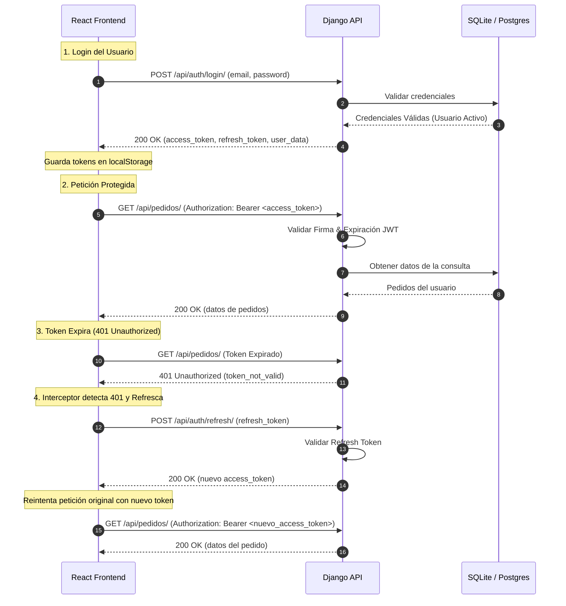

# 🔗 Integración Frontend-Backend y Flujo JWT

Esta sección detalla cómo se conectan las aplicaciones **Backend (Django REST Framework)** y **Frontend (React + Vite)**, las peticiones HTTP (endpoints) que se realizan entre ellas, el flujo detallado de autenticación con **JSON Web Tokens (JWT)** y cómo se implementan los requisitos de negocio y regulatorios (como la LOPDP) en ambos lados.

---

## 1. Modelo de Conectividad y Arquitectura

El proyecto adopta una arquitectura desacoplada ("Headless"), donde el Frontend y el Backend se ejecutan como servicios independientes que se comunican mediante una API REST en formato JSON.

### 🌐 Entornos de Ejecución Local
*   **Backend (Django)**: `http://localhost:8000`
*   **Frontend (React/Vite)**: `http://localhost:3000` (o puerto `5173`)

### 🔀 Configuración del Proxy (Vite)
Para evitar problemas de **CORS (Cross-Origin Resource Sharing)** en desarrollo local y facilitar el enrutamiento de peticiones sin exponer la URL absoluta del backend en el código del cliente, se configura un servidor proxy reverso en el archivo de configuración de Vite ([vite.config.js](file:///c:/Users/Luis%20Blacio/TiendaUniversitaria/frontend/vite.config.js)):

```javascript
// frontend/vite.config.js
export default defineConfig({
  plugins: [react()],
  server: {
    port: 3000,
    proxy: {
      '/api': {
        target: 'http://localhost:8000',
        changeOrigin: true,
        rewrite: (path) => path.replace(/^\/api/, '/api/v1'),
      },
    },
  },
});
```

> [!NOTE]
> Toda petición realizada a `/api/*` en el Frontend es interceptada por el servidor de desarrollo de Vite y redirigida a `http://localhost:8000/api/v1/*`. Por ejemplo:
> `POST /api/auth/login/` $\rightarrow$ `POST http://localhost:8000/api/v1/auth/login/`

---

## 2. Autenticación y Ciclo de Vida del Token JWT

La seguridad y autenticación del sistema se basa en **JSON Web Tokens (JWT)**. Se implementa usando la biblioteca `djangorestframework-simplejwt` en el Backend y un cliente HTTP centralizado con **Axios** en el Frontend.



### ⚙️ Configuración JWT en el Backend
En el archivo de configuración del Backend ([core/settings.py](file:///c:/Users/Luis%20Blacio/TiendaUniversitaria/core/settings.py)), se define el tiempo de expiración y las firmas:

```python
# core/settings.py
SIMPLE_JWT = {
    'ACCESS_TOKEN_LIFETIME': timedelta(hours=24), # Duración del token de acceso (24 horas)
    'REFRESH_TOKEN_LIFETIME': timedelta(days=7),   # Duración del token de refresco (7 días)
    'ROTATE_REFRESH_TOKENS': False,
    'ALGORITHM': 'HS256',
    'SIGNING_KEY': SECRET_KEY,
    'AUTH_HEADER_TYPES': ('Bearer',),
}
```

### 🛡️ Cliente HTTP y Manejo de Tokens en el Frontend
El cliente HTTP de Axios ([frontend/src/core/api/apiClient.js](file:///c:/Users/Luis%20Blacio/TiendaUniversitaria/frontend/src/core/api/apiClient.js)) gestiona automáticamente la inyección de cabeceras y la renovación silenciosa de tokens expirados:

#### A. Interceptor de Peticiones (Request)
Agrega automáticamente el token JWT almacenado en `localStorage` a las cabeceras de autorización en cada petición saliente:

```javascript
apiClient.interceptors.request.use(
  (config) => {
    const token = localStorage.getItem('jwt_token');
    if (token) {
      config.headers.Authorization = `Bearer ${token}`;
    }
    return config;
  },
  (error) => Promise.reject(error)
);
```

#### B. Interceptor de Respuestas (Response)
Captura errores de tipo `401 Unauthorized`. Si se detecta un fallo debido a token expirado, detiene las peticiones subsecuentes, realiza una llamada en segundo plano al endpoint de renovación, actualiza el token en memoria/almacenamiento y reintenta la petición original con el nuevo token sin que el usuario lo note:

```javascript
apiClient.interceptors.response.use(
  (response) => response,
  async (error) => {
    const originalRequest = error.config;

    // Si devuelve 401 y no se ha reintentado
    if (error.response?.status === 401 && !originalRequest._retry) {
      originalRequest._retry = true;

      try {
        const refreshToken = localStorage.getItem('jwt_refresh');
        if (refreshToken) {
          // Solicitar renovación del Token de Acceso
          const response = await axios.post(`${API_BASE_URL}/auth/refresh/`, {
            refresh: refreshToken,
          });

          // Guardar nuevo Token y reintentar petición original
          localStorage.setItem('jwt_token', response.data.access);
          originalRequest.headers.Authorization = `Bearer ${response.data.access}`;

          return apiClient(originalRequest);
        }
      } catch (refreshError) {
        // Si el refresh también falla, el token expiró completamente. Forzar Logout.
        localStorage.removeItem('jwt_token');
        localStorage.removeItem('jwt_refresh');
        window.location.href = '/login';
      }
    }
    return Promise.reject(error);
  }
);
```

---

## 3. Catálogo de Peticiones y Endpoints del Sistema

A continuación, se presenta la lista completa de endpoints REST disponibles, el tipo de petición que se realiza y los datos requeridos.

| Módulo | Método | Endpoint (Frontend Path) | Endpoint Real (Backend API) | Requiere Auth | Descripción |
| :--- | :--- | :--- | :--- | :---: | :--- |
| **Auth** | `POST` | `/api/auth/login/` | `/api/v1/auth/login/` | No | Autenticación con email/contraseña. Retorna tokens JWT. |
| **Auth** | `POST` | `/api/auth/refresh/` | `/api/v1/auth/refresh/` | No | Renueva el `access_token` usando el `refresh_token`. |
| **Auth** | `POST` | `/api/auth/logout/` | `/api/v1/auth/logout/` | No | Cierra la sesión activa. |
| **Usuarios** | `POST` | `/api/usuarios/registro/` | `/api/v1/usuarios/registro/` | No | Registra un nuevo cliente con aceptación LOPDP. |
| **Usuarios** | `GET` | `/api/usuarios/me/` | `/api/v1/usuarios/me/` | Sí | Obtiene los datos del perfil del usuario autenticado. |
| **Usuarios** | `PUT` | `/api/usuarios/me/` | `/api/v1/usuarios/me/` | Sí | Actualiza parcialmente los datos personales. |
| **Privacidad** | `GET` | `/api/politica-privacidad/` | `/api/v1/politica-privacidad/` | No | Obtiene la versión más reciente de la Política de Privacidad. |
| **Catálogo** | `GET` | `/api/productos/` | `/api/v1/productos/` | No | Lista los productos activos (con paginación, filtros y búsquedas). |
| **Catálogo** | `GET` | `/api/productos/{id}/` | `/api/v1/productos/{id}/` | No | Retorna los detalles de un producto en específico. |
| **Catálogo** | `POST` | `/api/productos/` | `/api/v1/productos/` | Sí (Admin) | Crea un nuevo producto (solo administradores). |
| **Pedidos** | `GET` | `/api/pedidos/` | `/api/v1/pedidos/` | Sí | Lista los pedidos (filtrados por cliente, o todos para Admins). |
| **Pedidos** | `POST` | `/api/pedidos/` | `/api/v1/pedidos/` | Sí | Crea un nuevo pedido con validación atómica de stock. |
| **Pedidos** | `GET` | `/api/pedidos/{id}/` | `/api/v1/pedidos/{id}/` | Sí | Obtiene detalles de un pedido específico y sus items. |
| **Pedidos** | `PUT` | `/api/pedidos/{id}/` | `/api/v1/pedidos/{id}/` | Sí (Admin) | Actualiza el estado del pedido (máquina de estados). |
| **Caja** | `POST` | `/api/cajas/procesar-venta/`| `/api/v1/cajas/procesar-venta/`| Sí (Cajero) | Registra una venta directa en caja. |
| **Caja** | `GET` | `/api/cajas/clientes/` | `/api/v1/cajas/clientes/` | Sí (Cajero) | Busca o registra clientes para facturación directa. |
| **Pagos** | `POST` | `/api/pagos/preparar-checkout/`| `/api/v1/pagos/preparar-checkout/`| Sí | Genera una sesión de checkout en Stripe. |
| **Pagos** | `POST` | `/api/pagos/crear-payment-intent/`| `/api/v1/pagos/crear-payment-intent/`| Sí | Genera un PaymentIntent de Stripe para elementos customizados. |
| **Dashboard** | `GET` | `/api/dashboard/stats/`| `/api/v1/dashboard/stats/`| Sí (Admin) | Devuelve estadísticas de ventas y alertas de stock para panel de control. |

---

## 4. Ejemplos de Requests y Responses Clave

### 🔑 A. Autenticación (Login)
*   **Request (`POST /api/auth/login/`):**
    ```json
    {
      "email": "estudiante@unl.edu.ec",
      "password": "PasswordSegura123!"
    }
    ```
*   **Response (200 OK):**
    ```json
    {
      "status": "success",
      "message": "Bienvenido Juan Pérez",
      "access_token": "eyJ0eXAiOiJKV1QiLCJhbGci...",
      "refresh_token": "eyJ0eXAiOiJKV1QiLCJhbGci...",
      "user": {
        "id": 5,
        "email": "estudiante@unl.edu.ec",
        "nombre_completo": "Juan Pérez",
        "rol": "CLIENTE",
        "is_universidad": true
      }
    }
    ```

### 📝 B. Registro de Usuario (Cumplimiento LOPDP)
*   **Request (`POST /api/usuarios/registro/`):**
    ```json
    {
      "nombre_completo": "María Luz",
      "email": "maria.luz@unl.edu.ec",
      "password": "MiPasswordSeguro123!",
      "identificacion": "1103987654",
      "telefono": "0987654321",
      "consentimiento_lopdp": true,
      "privacy_policy_version": "v1.0"
    }
    ```
*   **Response (201 Created):**
    ```json
    {
      "id": 6,
      "email": "maria.luz@unl.edu.ec",
      "nombre_completo": "María Luz",
      "rol": "CLIENTE",
      "consentimiento_lopdp": true,
      "consentimiento_timestamp": "2026-06-21T18:45:00Z"
    }
    ```

### 🛒 C. Crear un Pedido (Órdenes)
*   **Request (`POST /api/pedidos/`):**
    ```json
    {
      "tipo_entrega": "TIENDA",
      "detalles": [
        {
          "producto_id": 2,
          "cantidad": 3
        }
      ]
    }
    ```
*   **Response (201 Created):**
    ```json
    {
      "id": 14,
      "numero_pedido": "P-20260621-014",
      "cliente_nombre": "Juan Pérez",
      "estado": "RECIBIDO",
      "tipo_entrega": "TIENDA",
      "subtotal": "46.50",
      "impuesto": "5.58",
      "total": "52.08",
      "detalles": [
        {
          "id": 28,
          "producto": 2,
          "nombre_producto": "Camiseta Polo UNL",
          "cantidad": 3,
          "precio_unitario": "15.50",
          "subtotal": "46.50"
        }
      ]
    }
    ```

---

## 5. Implementación de Requisitos en Backend vs. Frontend

A continuación, se explica detalladamente cómo se abordan e implementan las especificaciones técnicas tanto en la capa lógica del Servidor como en la interfaz del Cliente.

### 🛡️ Requisito: Registro con Consentimiento LOPDP (Ecuador)
Garantiza que ningún usuario pueda registrarse o guardar información en el sistema sin aceptar de forma informada y explícita la política de privacidad.

*   **Implementación en el Backend:**
    *   **Modelo de Datos**: El modelo `Usuario` ([tienda/models.py](file:///c:/Users/Luis%20Blacio/TiendaUniversitaria/tienda/models.py)) extiende `AbstractUser` y posee campos dedicados para auditoría: `consentimiento_lopdp` (Boolean), `consentimiento_timestamp` (DateTime) y una llave foránea `privacy_policy` apuntando a la versión del acuerdo aceptado. El campo `consentimiento_timestamp` es inmutable una vez grabado.
    *   **Validación de Serializador**: En `UsuarioSerializer` ([tienda/serializers.py](file:///c:/Users/Luis%20Blacio/TiendaUniversitaria/tienda/serializers.py)), se obliga a que el valor de `consentimiento_lopdp` sea `True`. Si se envía vacío o como `False`, se aborta la creación y se devuelve un código `400 Bad Request`.
*   **Implementación en el Frontend:**
    *   **Formulario de Registro**: En `RegisterPage.jsx` ([RegisterPage.jsx](file:///c:/Users/Luis%20Blacio/TiendaUniversitaria/frontend/src/features/auth/pages/RegisterPage.jsx)), se renderiza un Checkbox obligatorio. El botón de envío está deshabilitado a nivel UI hasta que el usuario marque la aceptación.
    *   **Consulta de Políticas**: Al montar la página de registro, se consulta dinámicamente `/api/politica-privacidad/` para mostrar los términos correctos al usuario y pasar la versión vigente en el cuerpo del JSON enviado.

### 🔍 Requisito: Minimización de Datos
Evita capturar o procesar datos innecesarios de los estudiantes.

*   **Implementación en el Backend:**
    *   **Serializador Estricto**: Se define una lista explícita de campos permitidos en `UsuarioSerializer` (`Meta.fields`). Cualquier atributo adicional recibido en el JSON de la petición (como inyecciones maliciosas de roles, saldos, etc.) es ignorado o rechazado explícitamente mediante validación de `non_field_errors`.
*   **Implementación en el Frontend:**
    *   **Componentes de Entrada**: Los formularios solo recopilan el Nombre Completo, Email Institucional, Contraseña, Teléfono y Cédula. No se envían metadatos del dispositivo ni ubicaciones.

### 🛍️ Requisito: Catálogo de Productos Simple con Imágenes Externas
Permite visualizar la oferta académica e institucional.

*   **Implementación en el Backend:**
    *   **Modelo de Datos**: Modelo `Producto` que incluye un campo `imagen_url` de tipo `URLField` para almacenar links externos absolutos en lugar de cargar binarios pesados en el servidor local.
    *   **Acceso Público**: Se utiliza la clase de permisos `IsAuthenticatedOrReadOnly` en `ProductoViewSet` ([tienda/views.py](file:///c:/Users/Luis%20Blacio/TiendaUniversitaria/tienda/views.py)), permitiendo a usuarios anónimos consultar el catálogo pero restringiendo la creación, edición o eliminación a personal autorizado.
*   **Implementación en el Frontend:**
    *   **Componente de Catálogo**: La vista `ProductList.jsx` consume el endpoint público de productos y maneja filtros dinámicos locales (categoría, ordenamiento por precio y barra de búsqueda en tiempo real) y paginación.
    *   **Cálculo de Impuestos**: Si `aplica_impuesto` es verdadero en el JSON del producto, la tarjeta del producto o el resumen del carrito calcula y detalla visualmente el IVA (12%) de forma transparente.

### 📦 Requisito: Creación de Pedidos y Máquina de Estados
Gestión del ciclo de vida de los pedidos institucionales.

*   **Implementación en el Backend:**
    *   **Transacciones Atómicas**: La creación de pedidos se procesa bajo un bloque de transacción atómico (`with transaction.atomic():`). Esto garantiza que el stock del producto se reduzca al instante. Si múltiples usuarios intentan comprar el último artículo simultáneamente, la base de datos bloquea el registro (`select_for_update`) y rechaza el segundo intento de forma segura, evitando sobreventa (cero stock negativo).
    *   **Máquina de Estados**: Se implementan validaciones en el método de actualización del pedido. Las transiciones solo pueden avanzar en la jerarquía: `RECIBIDO` $\rightarrow$ `PREPARACION` $\rightarrow$ `LISTO` $\rightarrow$ `ENTREGADO`. Si un pedido es cancelado (`CANCELADO`), se ejecuta una rutina que devuelve las cantidades compradas al stock del producto automáticamente.
*   **Implementación en el Frontend:**
    *   **Módulo de Órdenes**: `OrderDetail.jsx` permite a los usuarios rastrear sus pedidos. Cada estado es mapeado a colores y badges específicos mediante el componente `OrderStatusBadge` (por ejemplo, amarillo para `RECIBIDO`, verde para `LISTO`, y rojo para `CANCELADO`), dando una experiencia intuitiva al cliente sobre el estado de su entrega.
