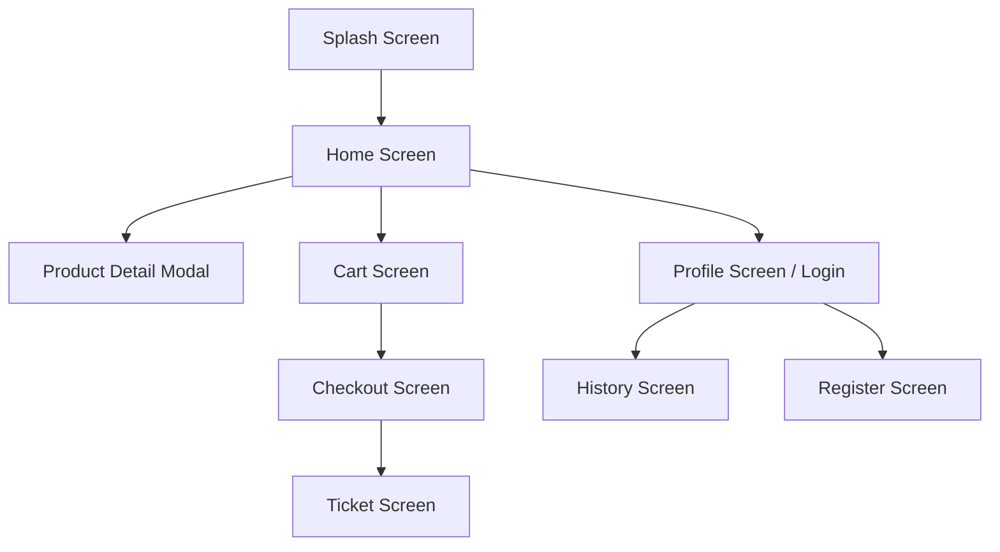
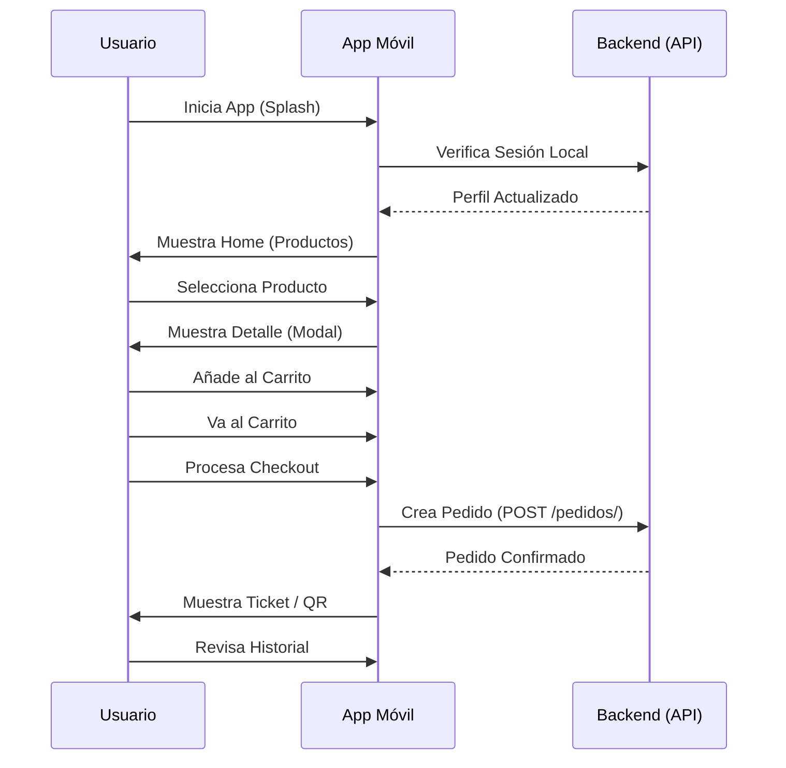

# Documentación Técnica - Aplicación Móvil
**Proyecto:** Tienda Universitaria UNL  
**Fecha:** 28 de Mayo de 2026

---

# 1. Descripción General del Proyecto

## Propósito de la Aplicación
La aplicación móvil de la **Tienda Universitaria UNL** tiene como objetivo proporcionar a la comunidad universitaria (estudiantes, docentes, administrativos) y al público en general un canal digital moderno y eficiente para la adquisición de productos institucionales, papelería, tecnología y alimentos.

## Objetivo del Proyecto
Transformar la experiencia de compra mediante una interfaz profesional, intuitiva y rápida, permitiendo la gestión de pedidos, visualización de historial de compras y descarga de comprobantes directamente desde dispositivos móviles.

## Arquitectura General
La aplicación está construida utilizando **React Native** con el ecosistema **Expo**, siguiendo una arquitectura basada en componentes y gestión de estado global mediante **Context API**. Se conecta a un backend desarrollado en Django REST Framework para el consumo de datos y procesamiento de pedidos.

## Flujo de Funcionamiento
1. **Arranque:** Splash screen animada con identidad visual.
2. **Autenticación:** El usuario inicia sesión o se registra (Comunidad UNL o Público General).
3. **Exploración:** Navegación por catálogo de productos destacados y categorías.
4. **Interacción:** Selección de variaciones (tallas, tamaños) y adición al carrito.
5. **Transacción:** Checkout simulado con selección de método de pago y confirmación de pedido.
6. **Seguimiento:** Visualización de historial de pedidos y descarga de tickets.

---

# 2. Tecnologías Utilizadas

| Tecnología | Propósito | Aplicación en el Proyecto |
|------------|-----------|--------------------------|
| **React Native** | Framework base | Desarrollo de la interfaz nativa multiplataforma. |
| **Expo (SDK 54)** | Entorno de desarrollo | Facilita el acceso a APIs nativas y el despliegue rápido. |
| **TypeScript** | Tipado estático | Mejora la robustez del código y facilita el mantenimiento. |
| **React Navigation** | Navegación | Gestión de pilas (Stack) y navegación inferior (Bottom Tabs). |
| **Context API** | Gestión de estado | Manejo global de autenticación y carrito de compras. |
| **AsyncStorage** | Persistencia local | Almacenamiento de tokens de sesión y estado del carrito. |
| **Lucide React Native** | Iconografía | Provee iconos vectoriales minimalistas y consistentes. |
| **Expo File System** | Manejo de archivos | Utilizado para la descarga y gestión de comprobantes PDF. |
| **Expo Sharing** | Compartición | Permite enviar el comprobante de pago a otras aplicaciones. |

---

# 3. Arquitectura del Proyecto

Estructura de carpetas en `app-movil/`:

```text
app-movil/
├── assets/             # Recursos estáticos (imágenes, iconos del sistema).
├── components/         # Componentes reutilizables de la UI.
├── constants/          # Valores constantes (Colores, configuraciones).
├── context/            # Proveedores de estado global (Auth, Cart, Theme).
├── mock/               # Datos de prueba para desarrollo (si aplica).
├── screens/            # Pantallas principales de la aplicación.
├── services/           # Lógica de consumo de APIs y servicios externos.
├── types/              # Definiciones de interfaces TypeScript.
├── utils/              # Funciones de ayuda y plantillas (ej. Invoice HTML).
├── App.tsx             # Punto de entrada principal y configuración de navegación.
└── index.ts            # Registro del componente principal.
```

---

# 4. Componentes

### Componentes Principales

- **`Header.tsx`**: Cabecera dinámica que muestra el saludo al usuario en la Home o el título en pantallas internas. Incluye acceso rápido a notificaciones y carrito.
- **`BottomNavigation.tsx`**: Barra de navegación inferior con acceso a Inicio, Carrito, Historial y Perfil.
- **`ProductCard.tsx`**: Tarjeta de visualización de producto con imagen, precio y botón de adición rápida.
- **`PromotionalBanner.tsx`**: Banner publicitario animado con identidad "Orgullo UNL".
- **`ProductDetailModal.tsx`**: Modal de pantalla completa para ver detalles técnicos, descripción y seleccionar variaciones antes de añadir al carrito.
- **`QuantitySelector.tsx`**: Control para incrementar o decrementar la cantidad de un ítem.
- **`SearchBar.tsx`**: Campo de búsqueda estilizado (Pre-integración).
- **`CategoryList.tsx`**: Lista horizontal de categorías con iconos representativos.
- **`AnimatedButton.tsx`**: Botón con efecto de escala al presionar para mejorar el feedback táctil.
- **`SkeletonLoader.tsx`**: Indicadores de carga tipo "esqueleto" para mejorar la percepción de rendimiento.

---

# 5. Pantallas

### Catálogo de Pantallas

1. **`SplashScreen.tsx`**: Animación de entrada en dos etapas (Blanco -> Verde UNL).
2. **`HomeScreen.tsx`**: Dashboard principal con buscador, banners, categorías y productos destacados.
3. **`RegisterScreen.tsx`**: Formulario de registro con diferenciación entre Comunidad UNL (correo @unl.edu.ec) y Público General.
4. **`ProfileScreen.tsx`**: Gestión de sesión del usuario, visualización de datos personales y acceso a configuración (Modo Oscuro). Actúa como pantalla de Login si no hay sesión activa.
5. **`CartScreen.tsx`**: Lista de productos seleccionados, resumen de precios y botón de checkout.
6. **`CheckoutScreen.tsx`**: Proceso de pago en pasos (Envío -> Pago -> Confirmación).
7. **`TicketScreen.tsx`**: Visualización del comprobante de pedido con código QR y opciones de descarga/impresión.
8. **`HistoryScreen.tsx`**: Listado de pedidos realizados con filtros por estado.

---

# 6. Navegación

La navegación se gestiona mediante un **Native Stack Navigator**:



---

# 7. Gestión del Estado

Se utilizan tres contextos principales envolviendo toda la aplicación en `App.tsx`:

1. **`AuthContext.tsx`**:
    - Maneja el objeto `user` y el `token`.
    - Lógica de `login`, `register` y `logout`.
    - Función `apiFetch` que inyecta automáticamente el token JWT en las cabeceras.
2. **`CartContext.tsx`**:
    - Gestiona el arreglo `cartItems`.
    - Calcula en tiempo real `subtotal`, `iva` y `total`.
    - Persiste el carrito en `AsyncStorage` para evitar pérdida de datos al cerrar la app.
3. **`ThemeContext.tsx`**:
    - Controla el modo claro/oscuro.
    - Expone el objeto `theme` basado en las constantes de `Colors.ts`.

La jerarquía de proveedores es la siguiente:
```tsx
<ThemeProvider>
  <AuthProvider>
    <CartProvider>
      <NavigationContainer>
        {/* ...Stack.Navigator */}
      </NavigationContainer>
    </CartProvider>
  </AuthProvider>
</ThemeProvider>
```

---

# 8. Consumo de API

### Estructura de Servicios
La aplicación utiliza una URL base dinámica detectada mediante `expo-constants` para facilitar el desarrollo en dispositivos físicos.

**Endpoints Principales:**
- `GET /productos/`: Listado de catálogo.
- `POST /auth/login/`: Autenticación.
- `POST /usuarios/registro/`: Creación de cuenta.
- `GET /usuarios/me/`: Datos del perfil.
- `GET /pedidos/`: Historial de compras.
- `POST /pedidos/`: Creación de nueva orden.

---

# 9. Diseño de Interfaz

### Sistema de Colores (`Colors.ts`)
Se ha implementado una paleta basada en el manual de marca de la UNL:
- **Primario:** `#006837` (Verde Institucional).
- **Secundario:** `#D1272D` (Rojo UNL).
- **Acento:** `#D4AF37` (Dorado UNL).
- **Superficies:** Blancos puros para Light Mode y Grises profundos (`#121212`) para Dark Mode.

### UX Highlights
- **Feedback Visual:** Uso de `AnimatedButton` en todas las interacciones táctiles.
- **Carga Elegante:** Implementación de Skeletons en `HomeScreen`.
- **Navegación Intuitiva:** Barra inferior con indicadores de estado activo.

---

# 10. Flujo Completo del Usuario

El siguiente diagrama describe el recorrido típico de un usuario en la aplicación:



---

# 11. Dependencias

| Paquete | Versión | Finalidad |
|---------|---------|-----------|
| `expo` | ~54.0.36 | SDK principal. |
| `react-native` | 0.81.5 | Framework nativo. |
| `lucide-react-native` | ^0.470.0 | Iconos vectoriales. |
| `@react-navigation/native` | ^7.3.3 | Navegación base. |
| `axios` | ^1.18.1 | Cliente HTTP. |
| `react-native-qrcode-svg` | ^6.3.14 | Generación de QR en tickets. |
| `expo-print` | ~14.0.3 | Generación de PDF. |

---

# 12. Buenas Prácticas

1. **Separación de Responsabilidades:** La lógica de datos reside en los Contextos, mientras que los componentes solo gestionan la presentación.
2. **Tipado Estricto:** Uso de interfaces para Productos, Usuarios y Pedidos.
3. **Reutilización:** Componentes como `AnimatedButton` y `QuantitySelector` son utilizados en múltiples pantallas.
4. **Security:** Los tokens JWT no se exponen directamente en los componentes, se gestionan mediante el wrapper `apiFetch`.

---

# 13. Mejoras Futuras

- [ ] **Búsqueda Avanzada:** Implementación de lógica de filtrado en `SearchBar.tsx`.
- [ ] **Notificaciones Push:** Alertas cuando un pedido cambie de estado a "Listo para retiro".
- [ ] **Favoritos:** Lista de deseos persistente.
- [ ] **Optimización de Imágenes:** Uso de formatos como WebP y caché avanzada.
- [ ] **Stripe Real:** Migración del modo simulación a pagos reales mediante `@stripe/stripe-react-native`.

---
